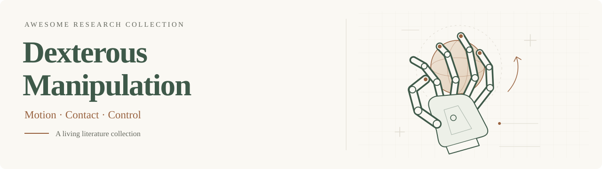

<div align="center">

# Awesome Dexterous Manipulation

**Research on multi-fingered robot hands, tactile feedback, and the learning of dexterous skills.**

[](https://awesome.re)
[](https://breez3young.github.io/Awesome-Dexterous-Manipulation/)
[](https://github.com/breez3young/Awesome-Dexterous-Manipulation/actions/workflows/dexterous-watch.yml)
[](#contributing)



### [Browse papers](https://breez3young.github.io/Awesome-Dexterous-Manipulation/) · [Explore stats](https://breez3young.github.io/Awesome-Dexterous-Manipulation/#stats) · [中文文献导读](docs/LITERATURE_MAP.zh-CN.md)

<sub>Search the collection, combine research tags, and read English and Chinese summaries with links to papers, projects, and code.</sub>

</div>

## What belongs in this collection?

The focus is **multi-fingered robotic manipulation**: grasping, in-hand reorientation, hand–arm coordination, bimanual skills, tool use, and learning from human demonstrations. A second thread follows **touch in manipulation**, from tactile sensors and representations to robot policies that use tactile observations during execution.

Selected work on human hand–object interaction, grasp generation, and policy optimization provides context. Each entry states its scope and the evidence behind its summary.

<details>
<summary><b>Scope and terminology</b></summary>

- **Tactile feedback** means the robot uses touch during execution. Contact rewards, privileged simulation state, and forces recorded in human demonstrations do not establish runtime tactile sensing.
- **Foundation policy** refers to a broadly pretrained control policy. It is a learning tag, not a name for general background resources.
- **Related resource** marks adjacent work, such as human-interaction data or gripper grasping; it does not imply a demonstrated multi-finger robot controller.
- Publication dates use the first arXiv submission, or the journal date for non-arXiv work. Simulation, real-robot experiments, and human data are distinguished in the reading notes.

See the [literature guide](docs/LITERATURE_MAP.zh-CN.md) and [review rules](docs/CODEX_REVIEW.zh-CN.md) for the full definitions.

</details>

<details>
<summary><b>Research areas and tags</b></summary>

| Research area | Main focus |
|:--|:--|
| **Dexterous Manipulation** | Multi-finger robot control, retargeting, teleoperation, and learned manipulation |
| **Tactile Dexterous Manipulation** | Dexterous systems with tactile sensing and policies using touch |
| **Tactile Sensing & Representation** | Sensors, tactile simulation, and learned touch representations |
| **Hand–Object Interaction** | Human hand motion, hand–object perception, and interaction modeling |
| **Grasp Synthesis** | Grasp generation, quality prediction, and selection |
| **Policy Optimization** | General policy-training algorithms evaluated on manipulation |

Each paper has one primary area. Tags add five complementary views: **Policy & learning**, **Data & transfer**, **Manipulation skills**, **Sensing & contact**, and **Research resources**. Areas combine with OR; topic tags combine with AND. `Dataset / benchmark` remains a resource tag across areas.

</details>

<!-- BEGIN GENERATED CATALOG: update with node scripts/build_readme.cjs -->

## At a glance

<p align="center"><b>59 papers</b> · <b>10 tactile dexterity papers</b> · <b>26 code links</b> · 6 research areas · <a href="https://breez3young.github.io/Awesome-Dexterous-Manipulation/">browse the collection</a></p>

| Research area | Papers |
|:--|--:|
| <a href="https://breez3young.github.io/Awesome-Dexterous-Manipulation/?area=Dexterous%20Manipulation">Dexterous Manipulation</a> | 41 |
| <a href="https://breez3young.github.io/Awesome-Dexterous-Manipulation/?area=Tactile%20Dexterous%20Manipulation">Tactile Dexterous Manipulation</a> | 10 |
| <a href="https://breez3young.github.io/Awesome-Dexterous-Manipulation/?area=Tactile%20Sensing%20%26%20Representation">Tactile Sensing &amp; Representation</a> | 4 |
| <a href="https://breez3young.github.io/Awesome-Dexterous-Manipulation/?area=Hand%E2%80%93Object%20Interaction">Hand–Object Interaction</a> | 2 |
| <a href="https://breez3young.github.io/Awesome-Dexterous-Manipulation/?area=Grasp%20Synthesis">Grasp Synthesis</a> | 1 |
| <a href="https://breez3young.github.io/Awesome-Dexterous-Manipulation/?area=Policy%20Optimization">Policy Optimization</a> | 1 |

Counts describe this curated collection. Code links may cover data tools, simulation, or hardware rather than a complete policy implementation. Explore release trends and tag distributions in [Stats](https://breez3young.github.io/Awesome-Dexterous-Manipulation/#stats).

## Start here

Seven reading routes through the collection, spanning robot control, touch, and human-to-robot transfer.

| Reading route | Paper | Year | Resources |
|:--|:--|:--:|:--|
| Learning in-hand control | <b>Learning Dexterous In-Hand Manipulation</b> | 2018 | <a href="https://arxiv.org/abs/1808.00177">Paper</a> · <a href="https://openai.com/index/learning-dexterity/">Project</a> |
| Human-to-robot teleoperation | <b>DexPilot: Vision Based Teleoperation of Dexterous Robotic Hand-Arm System</b> | 2019 | <a href="https://arxiv.org/abs/1910.03135">Paper</a> · <a href="https://sites.google.com/view/dex-pilot">Project</a> |
| Fingertip tactile hardware | <b>DIGIT: A Novel Design for a Low-Cost Compact High-Resolution Tactile Sensor with Application to In-Hand Manipulation</b> | 2020 | <a href="https://arxiv.org/abs/2005.14679">Paper</a> · <a href="https://digit.ml/digit.html">Project</a> · <a href="https://github.com/facebookresearch/digit-design">Code</a> |
| Tactile simulation | <b>TACTO: A Fast, Flexible, and Open-source Simulator for High-Resolution Vision-based Tactile Sensors</b> | 2020 | <a href="https://arxiv.org/abs/2012.08456">Paper</a> · <a href="https://github.com/facebookresearch/tacto">Project</a> · <a href="https://github.com/facebookresearch/tacto">Code</a> |
| Manipulation through touch | <b>Rotating without Seeing: Towards In-hand Dexterity through Touch</b> | 2023 | <a href="https://arxiv.org/abs/2303.10880">Paper</a> · <a href="https://touchdexterity.github.io/">Project</a> · <a href="https://github.com/YingYuan0414/in-hand-rotation">Code</a> |
| Tactile-reactive policies | <b>T-Rex: Tactile-Reactive Dexterous Manipulation</b> | 2026 | <a href="https://arxiv.org/abs/2606.17055">Paper</a> · <a href="https://tactile-reactive-dexterous.github.io/">Project</a> · <a href="https://github.com/ZhuoyangLiu2005/T-Rex">Code</a> |
| Contact-aware motion transfer | <b>Morphometric Imitation: From Morphology and Contact Aware Hand Retargeting to Sim-to-Real Visuomotor Policy</b> | 2026 | <a href="https://arxiv.org/abs/2609.28660">Paper</a> · <a href="https://morphometricimitation.github.io/">Project</a> · <a href="https://github.com/tsadja/morphometric">Code</a> |

## Recent papers

The most recent first releases in the curated catalog. Dates below are publication dates, not dates added to this repository.

| First released | Paper | Research area | Resources |
|:--|:--|:--|:--|
| 2026-10-07 | <b>Temporal Visuo-Tactile Learning for Dexterous Grasp Stability</b> | Tactile Dexterous Manipulation | <a href="https://arxiv.org/abs/2610.10283">Paper</a> · <a href="https://lasr-lab.github.io/dexterous-grasp-stability/">Project</a> · <a href="https://github.com/lasr-lab/dexterous-grasp-stability">Code</a> |
| 2026-09-23 | <b>Morphometric Imitation: From Morphology and Contact Aware Hand Retargeting to Sim-to-Real Visuomotor Policy</b> | Dexterous Manipulation | <a href="https://arxiv.org/abs/2609.28660">Paper</a> · <a href="https://morphometricimitation.github.io/">Project</a> · <a href="https://github.com/tsadja/morphometric">Code</a> |
| 2026-07-30 | <b>UniCross: Unified Cross-Skill Dexterous Manipulation Synthesis</b> | Dexterous Manipulation | <a href="https://arxiv.org/abs/2607.28198">Paper</a> |
| 2026-07-13 | <b>Towards Human-level Dexterous Teleoperation</b> | Dexterous Manipulation | <a href="https://arxiv.org/abs/2607.11481">Paper</a> |
| 2026-07-03 | <b>Cross-Embodiment Robot Manipulation via a Unified Hand Action Space</b> | Dexterous Manipulation | <a href="https://arxiv.org/abs/2607.03570">Paper</a> |
| 2026-06-22 | <b>Learning Dexterous Manipulation Using Contact Wrench Guidance From Human Demonstration</b> | Dexterous Manipulation | <a href="https://arxiv.org/abs/2607.00033">Paper</a> |
| 2026-06-15 | <b>T-Rex: Tactile-Reactive Dexterous Manipulation</b> | Tactile Dexterous Manipulation | <a href="https://arxiv.org/abs/2606.17055">Paper</a> · <a href="https://tactile-reactive-dexterous.github.io/">Project</a> · <a href="https://github.com/ZhuoyangLiu2005/T-Rex">Code</a> |
| 2026-06-11 | <b>Mana: Dexterous Manipulation of Articulated Tools</b> | Dexterous Manipulation | <a href="https://arxiv.org/abs/2606.13677">Paper</a> |

[View the full catalog](https://breez3young.github.io/Awesome-Dexterous-Manipulation/) for summaries, evaluation context, and combinations of learning, sensing, and task tags.
<!-- END GENERATED CATALOG -->

## Daily discovery and review

| Stage | When | What happens |
|:--|:--|:--|
| **Discover** | Daily, 09:35 Beijing time | GitHub Actions searches recent arXiv updates and collects candidates. |
| **Review** | Daily, 10:05 Beijing time | Local Codex checks primary sources, assigns tags, and writes bilingual summaries in a review PR. |
| **Publish** | After maintainer approval | The maintainer merges the PR; GitHub Pages publishes the updated collection. |

Codex records **accept**, **defer**, or **reject** with source links and reasons. The local review requires the computer and app to be running; GitHub discovery runs independently. Neither stage merges its own PR. [Review protocol](docs/CODEX_REVIEW.zh-CN.md) · [Setup guide](docs/GITHUB_ACTIONS_SETUP.zh-CN.md) · [Open review PRs](https://github.com/breez3young/Awesome-Dexterous-Manipulation/pulls)

## Contributing

Paper suggestions, missing links, corrections, and scope discussions are welcome. [Open an issue](https://github.com/breez3young/Awesome-Dexterous-Manipulation/issues/new) with a primary paper link and a short explanation of its relevance, or submit a pull request updating [papers.json](papers.json).

Use the existing research areas and tags, distinguish simulation from real-robot results, and verify whether touch is actually an execution-time input. Include concise English and Chinese summaries and source links. Instructions for local preview and validation are in the [maintenance guide](docs/MAINTENANCE.md).

## Citation

```bibtex
@misc{zhang2026awesomedexterous,
  title = {Awesome Dexterous Manipulation},
  author = {Yang Zhang},
  year = {2026},
  howpublished = {GitHub repository},
  url = {https://github.com/breez3young/Awesome-Dexterous-Manipulation}
}
```

## Star History

<a href="https://www.star-history.com/#breez3young/Awesome-Dexterous-Manipulation&Date">
  <picture>
    <source media="(prefers-color-scheme: dark)" srcset="https://api.star-history.com/svg?repos=breez3young%2FAwesome-Dexterous-Manipulation&amp;type=Date&amp;theme=dark" />
    
  </picture>
</a>

---

<div align="center">
<sub>Maintained by <a href="https://breez3young.github.io/">Yang Zhang</a> · Inspired by <a href="https://github.com/huskydoge/Awesome-Loop-Models">Awesome Loop Models</a> by Benhao Huang · Catalog overview generated from <a href="papers.json">papers.json</a>.</sub>
</div>
